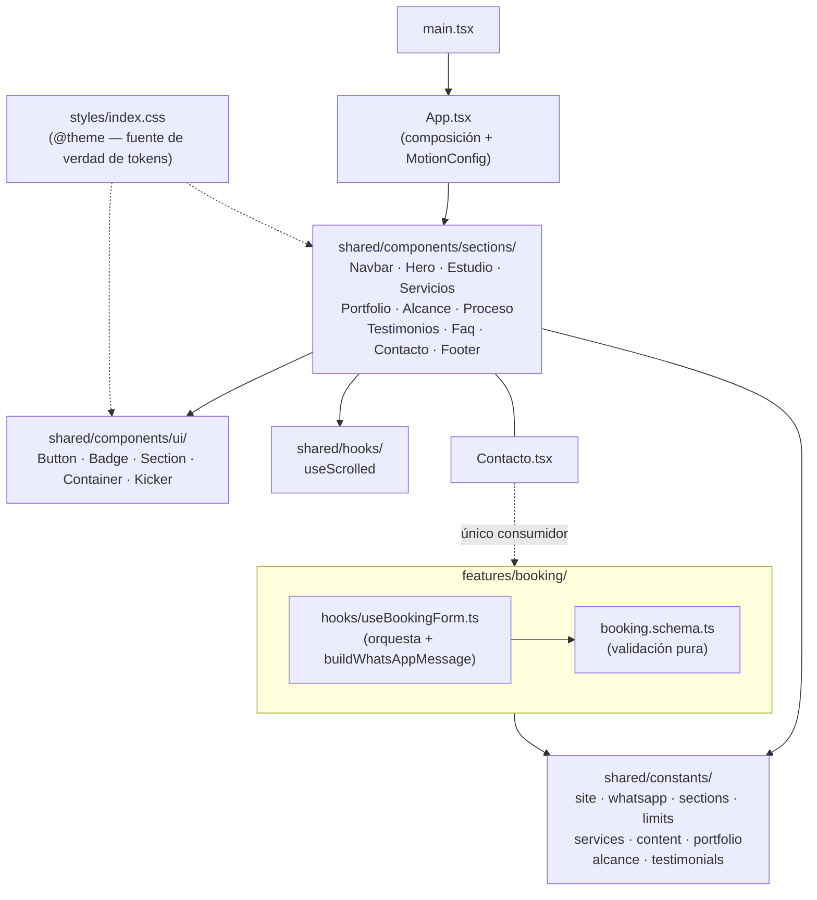
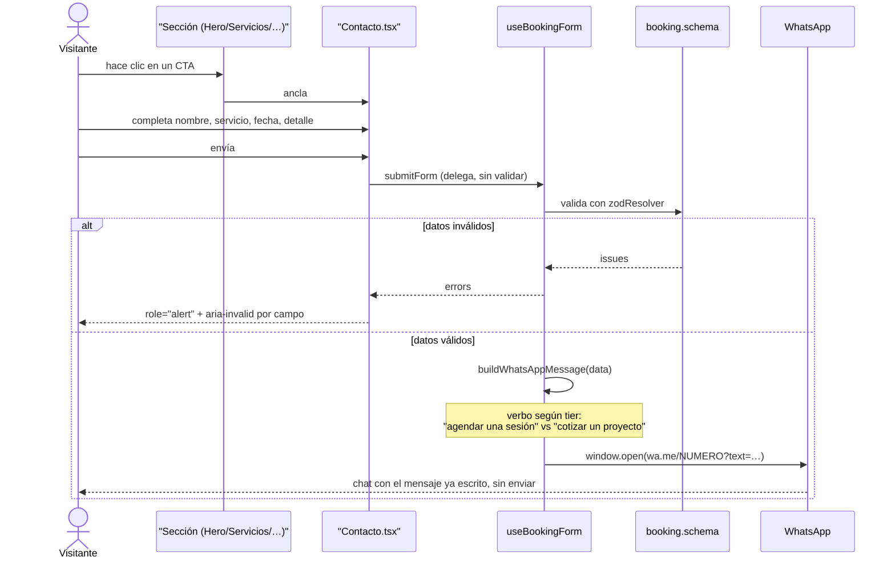

# Arquitectura — ALIENSKILEZ web

Fecha: 2026-08-12
Estado: implementado y verificado (`npm run lint`, `npm test` 24/24, `npm run build` limpios).
Alcance: one-pager de conversión para ALIENSKILEZ, productor musical en La Serena, Chile.

## 1. El problema que resuelve

Todo el sitio existe para **un solo resultado**: que un artista escriba por WhatsApp. No es un
portafolio, no es un EPK, no es una tarjeta de presentación. Cada sección se justifica por cuánto
acerca al visitante a ese mensaje, o se elimina.

Esa restricción es la que explica casi todas las decisiones de abajo: no hay backend porque el
cierre ocurre en WhatsApp; no hay CMS porque el contenido cambia poco; no hay router porque una
página que se recorre scrolleando convierte mejor que una que obliga a navegar.

## 2. Stack

Deliberadamente más chico que un proyecto institucional. Es una decisión, no una limitación.

- **React 19** + **TypeScript estricto** (`strict: true` + `noUncheckedIndexedAccess`).
- **Vite 8 (flavor rolldown)** + `@vitejs/plugin-react` 6.
- **React Compiler** activo (ADR-3) — sin memoización manual en todo el repo.
- **Tailwind CSS v4** vía `@tailwindcss/vite`, CSS-first con `@theme`. Sin `tailwind.config.js`.
- **Framer Motion** para scroll-reveal y microinteracciones, con `reducedMotion="user"`.
- **react-hook-form + zod** para el único formulario real.
- **Vitest** para la única lógica que puede fallar.
- **ESLint flat config** + `typescript-eslint` + `eslint-plugin-react-hooks@7` (que ya incluye
  las reglas del React Compiler, ADR-4) + Prettier.

Sin backend, sin base de datos, sin autenticación, sin i18n, sin router, sin librería de
componentes. Cada una de esas ausencias es una decisión registrada abajo.

## 3. Mapa de módulos

**Regla de dependencia:** las secciones dependen de primitivos de UI y de constantes, nunca entre
sí. `App.tsx` solo las ordena. `features/booking/` no importa ningún componente — es lógica pura
más un hook, y el único que lo consume es `Contacto.tsx`.

**Regla de orquestación:** la secuencia "validar → armar el mensaje → abrir WhatsApp" vive en
`useBookingForm`, nunca en el JSX. `Contacto.tsx` solo renderiza campos y delega el `onSubmit`.

## 4. Modelo de contenido

No hay entidades persistidas — no hay base de datos. Lo que sí existe es un modelo de **datos de
negocio tipados**, todos en `shared/constants/`, que las secciones consumen sin conocer su origen.

| Tipo | Archivo | Forma | Estado del dato |
|---|---|---|---|
| `Service` | `constants/services.ts` | `id`, `label`, `description`, `tier` | **Real** — 10 servicios confirmados |
| `SITE` / `SOCIALS` | `constants/site.ts` | nombre, ciudad, redes | Real, salvo URL de Spotify |
| `WHATSAPP` | `constants/whatsapp.ts` | número internacional | **Placeholder bloqueante** |
| `PortfolioItem` | `constants/portfolio.ts` | `title`, `artist`, `role`, `year`, `embedUrl` | Placeholder (5 slots) |
| `ImpactMetric` | `constants/alcance.ts` | `value`, `label`, `caption`, `measurement` | Placeholder `[XX]` (4 métricas) |
| `Testimonial` | `constants/testimonials.ts` | `quote`, `author`, `role` | Placeholder (3 slots) |
| `BookingFormValues` | `features/booking/booking.schema.ts` | inferido de zod (`z.infer`) | Real |

Cada tipo con dato pendiente lleva una bandera `pending: boolean`. Los componentes la usan para
degradar visualmente (atenuar el número, no renderizar un `<iframe>` vacío, ocultar un enlace sin
URL) en vez de mostrar algo roto. Ver ADR-6.

`ImpactMetric.measurement` es documentación en el código: describe **de dónde sale** cada cifra,
para que llenarla sea reproducible el año siguiente y no una estimación distinta cada vez.

## 5. El único flujo del sistema

El mensaje **no se envía solo**: se precarga y el visitante lo revisa antes de mandarlo. Es
deliberado — reduce la sensación de formulario que dispara algo fuera de su control, y le permite
agregar contexto.

## 6. Decisiones de arquitectura (ADR)

### ADR-1 — Sin backend: WhatsApp es el canal de cierre

**Contexto:** un formulario de contacto tradicional necesita un endpoint que reciba, valide,
persista y notifique.
**Decisión:** no hay servidor propio. El "envío" es construir una URL `wa.me` con el mensaje
codificado y abrirla en una pestaña nueva.
**Por qué:** el negocio ya cierra por WhatsApp Business — es donde el productor efectivamente
responde. Un backend agregaría hosting, base de datos, notificaciones y mantenimiento para
terminar reenviando el lead al mismo WhatsApp. El sitio queda 100% estático y desplegable en
cualquier CDN.
**Consecuencia aceptada:** no hay registro propio de leads; el historial vive en WhatsApp
Business. Si en algún momento hace falta analítica de conversión real, esto se reevalúa — no
antes.

### ADR-2 — Primitivos de UI propios, sin librería de componentes

**Contexto:** el patrón habitual en proyectos más grandes es envolver una librería (MUI, Chakra)
detrás de componentes `App*` para poder cambiarla sin reescribir la app.
**Decisión:** `Button`, `Badge`, `Section`, `Container` y `Kicker` se escriben directo sobre
Tailwind, en `shared/components/ui/`.
**Por qué:** ese patrón de wrapper existe para abstraer **una librería externa**. Acá no hay
ninguna que abstraer, así que el wrapper sería ceremonia sin propósito. Además, la identidad
visual (bordes duros, glow neón, brackets HUD) requeriría sobrescribir casi todos los estilos por
defecto de cualquier librería — más trabajo, no menos.
**Consecuencia:** los primitivos deben mantener una API consistente entre sí (`variant`/`size`),
porque no hay una librería que la imponga.

### ADR-3 — React Compiler vía `reactCompilerPreset`, no `babel-plugin-react-compiler` directo

**Contexto:** la forma documentada de activar el compilador en Vite clásico es
`babel: { plugins: [["babel-plugin-react-compiler", {}]] }` dentro de `@vitejs/plugin-react`.
**Decisión:** este proyecto usa el flavor **rolldown-vite**, donde se activa con
`@rolldown/plugin-babel` + `reactCompilerPreset()` de `@vitejs/plugin-react` — que es lo que el
scaffold ya traía.
**Por qué:** el objetivo real es que el compilador **compile**, no una sintaxis literal. Se
verificó contra el bundle de producción: 36 apariciones de `memo_cache_sentinel`, que es el
símbolo que emite el compilador al inicializar los slots de caché de cada componente. Forzar la
sintaxis de Vite clásico habría roto el build sin ganar nada.
**Consecuencia vinculante:** **no se usa `useMemo`, `useCallback` ni `React.memo` manual** en
ningún archivo. Ver ADR-9 para el efecto colateral que esto tuvo sobre el código.

### ADR-4 — `eslint-plugin-react-compiler` no se instala: está absorbido en `eslint-plugin-react-hooks@7`

**Contexto:** la especificación inicial pedía instalar `eslint-plugin-react-compiler` como gate de
lint separado.
**Decisión:** no se instala. Se verificó que `eslint-plugin-react-hooks@7.1.1` ya expone las
reglas del compilador, y que su config `recommended` activa entre otras `immutability`, `purity`,
`preserve-manual-memoization`, `set-state-in-effect`, `set-state-in-render` y `static-components`.
**Por qué:** el paquete standalone quedó deprecado al fusionarse en `react-hooks`. Instalarlo
duplicaría reglas ya activas y agregaría una dependencia sin mantenimiento.
**Verificación:** `node -e "require('eslint-plugin-react-hooks').configs.recommended"` lista las
16 reglas activas.

### ADR-5 — Dos CTA de negocio, un solo destino

**Contexto:** el diseño de referencia tenía un CTA único ("Cotiza tu sesión"). Pero ALIENSKILEZ
ofrece 10 líneas de servicio, y cuatro de ellas (asesoría, manager, marketing, construcción de
estudios) no son "sesiones" — decir "agenda tu sesión de marketing" suena mal y confunde el
alcance.
**Decisión:** dos CTA con copy distinto según el tipo de trabajo, ambos apuntando al **mismo**
formulario (`#contacto`):
- **"Agenda tu sesión"** — servicios con `tier: "sesion"` (producción, grabación, mezcla, máster,
  visuales, show en vivo). Es también el CTA persistente del navbar.
- **"Cotiza tu proyecto"** — servicios con `tier: "proyecto"` (asesoría, manager, marketing,
  construcción de estudios).

El `tier` vive en `constants/services.ts` y es la misma fuente que usa `buildWhatsAppMessage()`
para elegir el verbo del mensaje ("Quiero agendar una sesión de…" vs "Quiero cotizar un proyecto
de…"). Un solo dato gobierna copy del botón y texto del mensaje.
**Por qué un solo destino:** dos formularios duplicarían la validación y el mantenimiento para
capturar exactamente el mismo lead. El visitante elige el servicio exacto en el selector.
**Alternativa descartada:** preseleccionar el servicio al hacer clic en la card correspondiente.
Requeriría un canal de estado entre componentes y un efecto de sincronización que pelea con las
reglas de pureza del compilador (ADR-3), a cambio de ahorrarle al visitante un clic en un
`<select>` que ya tiene delante. No se justifica todavía.

### ADR-6 — Los datos de negocio que no existen se marcan, no se inventan

**Contexto:** al construir el sitio faltaban cifras de trayectoria, testimonios y trabajos del
portfolio. La tentación es rellenar con valores "realistas" para que el diseño se vea completo.
**Decisión:** cada dato faltante se publica con marcador visible (`[XX]`, `[Nombre del artista]`,
`[Reproductor pendiente]`) y una bandera `pending: true` que los componentes usan para degradar
la presentación. Nunca una cifra o cita plausible.
**Por qué:** una cifra inventada en un sitio de negocio es una afirmación falsa frente a clientes
reales, y "lanzamientos producidos" es verificable por cualquiera en Spotify. El costo de
desmentirla después es mucho mayor que el de mostrar un placeholder mientras tanto. El marcador
además **funciona como recordatorio**: es imposible desplegar sin notarlo.
**Consecuencia:** las secciones Alcance, Testimonios y Portfolio se renderizan siempre (para
poder evaluar el diseño), pero su contenido grita que está pendiente.

### ADR-7 — Los tokens de diseño viven en CSS (`@theme`), no en TypeScript

**Contexto:** una alternativa común es un `tokenRegistry.ts` que exporta los valores y se importa
donde haga falta.
**Decisión:** la paleta, tipografía, radios y espaciado de sección se definen una sola vez en
`src/styles/index.css` dentro de `@theme`, y Tailwind v4 genera las utilidades correspondientes
(`bg-surface-alt`, `text-text-muted`, `border-border-accent`, `py-section`, `font-display`).
**Por qué:** con Tailwind v4 CSS-first, `@theme` **es** el registro de tokens — mantener además
un espejo en TypeScript crearía dos fuentes de verdad que se desincronizan. Ningún componente
escribe un color literal; todos usan la utilidad generada.
**Verificación:** las 7 utilidades derivadas de tokens aparecen en el CSS compilado, y los 5
colores de la paleta aparecen con su valor exacto.
**Consecuencia:** un color nuevo se agrega en `@theme`, nunca como clase arbitraria
`bg-[#08cb00]` en un componente.

### ADR-8 — `no-restricted-imports` del core en vez de `eslint-plugin-import`

**Contexto:** la regla pedida era `import/no-relative-parent-imports: error`, para forzar el alias
`@/` en vez de rutas relativas largas.
**Decisión:** se implementa con la regla nativa `no-restricted-imports`, con el patrón `../*` y un
mensaje explícito.
**Por qué:** `eslint-plugin-import` declara ESLint `^9` como máximo en sus peer dependencies y
este proyecto usa ESLint 10; instalarlo exigiría `--legacy-peer-deps` y quedaría expuesto a romper
en cualquier actualización. La regla del core impone exactamente la misma restricción, con cero
dependencias nuevas.

### ADR-9 — Sin estado derivado de efectos: `useSyncExternalStore` y cómputo fuera del render

**Contexto:** el navbar cambia de fondo al scrollear. El patrón reflejo es
`useState` + `useEffect` con un listener que llama `setState`.
**Decisión:** `useScrolled()` usa `useSyncExternalStore(subscribe, getSnapshot)`. Y todo cómputo
impuro que antes iba en el cuerpo del componente (`new Date()` para el año del footer y para el
`min` del datepicker) se subió a constante de módulo.
**Por qué:** las reglas `react-hooks/set-state-in-effect` y `react-hooks/purity` (ADR-4) son
`error`, no advertencia — el código con el patrón reflejo **no pasa el lint**. Además
`useSyncExternalStore` lee el valor real en el primer render, sin el parpadeo que tiene la versión
con efecto.
**Regla general que se desprende:** si un componente necesita leer algo externo y cambiante
(scroll, `matchMedia`, tamaño de ventana), es `useSyncExternalStore`. Si necesita un valor impuro
pero estable durante la vida de la página, es una constante de módulo.

### ADR-10 — Texto negro sobre los botones de acento

**Contexto:** el color de acento de la marca es `#08CB00` (verde neón) y el color de texto es
`#EEEEEE`.
**Decisión:** los botones con fondo de acento usan texto `#000000`. El verde nunca se usa como
color de texto de cuerpo en tamaño chico — queda reservado a titulares, kickers, bordes e iconos.
**Por qué:** se calcularon los contrastes reales en vez de asumirlos. `#EEEEEE` sobre `#08CB00`
da **1.89:1** — reprueba cualquier nivel de WCAG. `#000000` sobre `#08CB00` da **9.55:1** (AAA).
La tabla completa está en [`design-system.md`](./design-system.md) §2.
**Nota:** la primera versión de este documento afirmaba 9.1:1 y 6.4:1 de memoria; al calcularlos
resultaron 9.55:1 y 5.74:1. El acento sobre `--color-surface` es **AA, no AAA** — por eso la
regla de no usarlo en texto chico es más estricta de lo que parecía.

## 7. Decisiones de arquitectura abiertas

A diferencia de la sección anterior, estas **no están cerradas**. Se documentan igual porque ya
tienen consecuencias reales sobre el diseño (aparecen como requisito propuesto en
`rf-rnf-catalogo.md` y como ticket en `backlog.md`), pero falta que alguien con autoridad sobre el
negocio elija entre las opciones.

### ADR-11 (abierta) — Cómo conectar el portfolio con Spotify y YouTube

**Contexto:** RF-POR-002 pide que el portfolio refleje el catálogo real de ALIENSKILEZ en Spotify
(y, en menor medida, YouTube) sin depender de que alguien lo copie a mano en `portfolio.ts` cada
vez que sale un tema. El problema es que esto **choca de frente con ADR-1** — "sin backend, sin
secretos" — porque la Web API de Spotify que da metadata rica (álbumes, tracks, fechas) usa Client
Credentials, y un `client_secret` no puede vivir en el bundle de un sitio estático sin quedar
visible en las devtools de cualquiera.

**Opciones evaluadas, sin descartar ninguna todavía:**

| Opción | Secretos expuestos | Control de la UI | Se desincroniza del catálogo | Costo de infraestructura |
|---|---|---|---|---|
| **1. Embed oficial** (`open.spotify.com/embed/artist/{id}`) | Ninguno | Bajo — la UI la define Spotify | No — siempre en vivo | Cero, sigue siendo 100% estático |
| **2. Función serverless** (Vercel/Netlify Function que llama la Web API y cachea la respuesta) | Ninguno expuesto al cliente (el secret vive en el entorno de la función) | Total — UI propia con el sistema de diseño del sitio | No | Introduce el primer "backend", aunque sea mínimo — rompe ADR-1 tal como está escrito hoy |
| **3. Carga manual** (lo que ya existe en `portfolio.ts`) | Ninguno | Total | **Sí** — es exactamente el problema que RF-POR-002 quiere resolver | Cero |

YouTube tiene una variante propia: su Data API v3 sí admite una API key de solo lectura
restringida por dominio (no requiere OAuth para datos públicos), lo que la hace viable sin
backend — pero sigue siendo la primera credencial del proyecto, y una API key mal restringida es
una forma más silenciosa de exponer algo que un `client_secret` obviamente sensible.

**Lo que falta para cerrar esto:** una decisión del Productor sobre si vale la pena introducir la
primera pieza de infraestructura del proyecto (opción 2) a cambio de una UI propia, o si el embed
oficial (opción 1) alcanza — y el `Spotify Artist ID` real de ALIENSKILEZ, que ninguna de las tres
opciones puede evitar necesitar.
**Seguimiento:** ALS-026 (Spotify) y ALS-027 (YouTube) en `backlog.md`.

### Pendiente de definición — Hero con marca 3D interactiva

RF nuevo (sin ID formal todavía) pide una pieza 3D de la marca que rote al hacer click y arrastrar,
más un efecto de "aura" que sigue al cursor en el fondo del Hero. La segunda parte no tiene
decisión pendiente — es CSS puro, mismo criterio que el resto de los motivos gráficos (§5 de
`design-system.md`). La primera sí: no existe todavía un asset 3D ni un isotipo definitivo (ver
"Sin imágenes propias" en §8), así que el ticket está bloqueado por diseño, no por arquitectura.
**Seguimiento:** ALS-028 (hero 3D) y ALS-029 (aura de mouse) en `backlog.md`.

## 8. Deuda conocida y diferida a propósito

Documentado como decisión, no como olvido:

- **Sin analítica de conversión.** No se sabe cuántos visitantes llegan al formulario ni cuántos
  abren WhatsApp. Se agrega cuando haya tráfico real que medir; hoy sería instrumentar a ciegas.
- **Sin preselección de servicio desde las cards** — ver ADR-5.
- **Sin pipeline de CI bloqueante.** `lint + test + build` se corren a mano antes de desplegar
  (ver [`quality-gates.md`](./quality-gates.md)). Para un sitio de una página que mantiene una
  sola persona, un CI pesado agrega fricción sin beneficio proporcional. Se reevalúa si el sitio
  crece o si toca el código más de una persona.
- **Sin imágenes propias.** No hay fotos del estudio ni isotipo definitivo; el favicon actual es
  interino. Bloqueado por falta de las piezas gráficas, no por código.

## 9. Documentos relacionados

- [`engineering-guidelines.md`](./engineering-guidelines.md) — cómo se escribe código acá.
- [`design-system.md`](./design-system.md) — tokens, contrastes verificados, tipografía.
- [`quality-gates.md`](./quality-gates.md) — umbrales y checklists previos a desplegar.
- [`rf-rnf-catalogo.md`](./rf-rnf-catalogo.md) — requisitos formales que este diseño satisface.
- [`backlog.md`](./backlog.md) — qué está hecho y qué falta.
