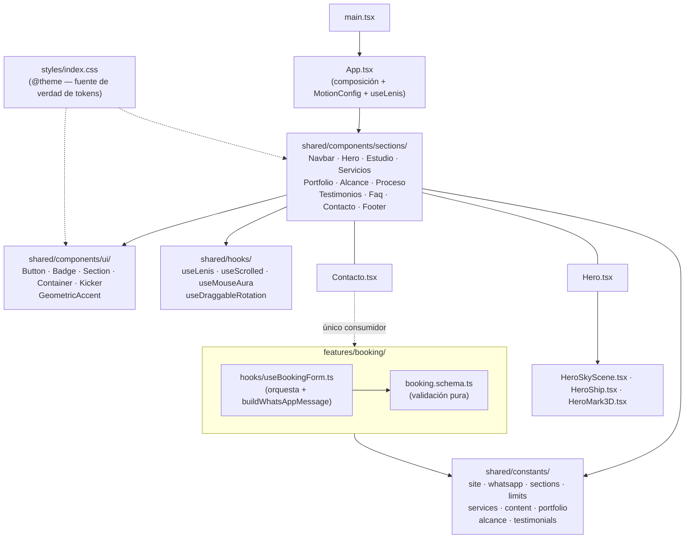
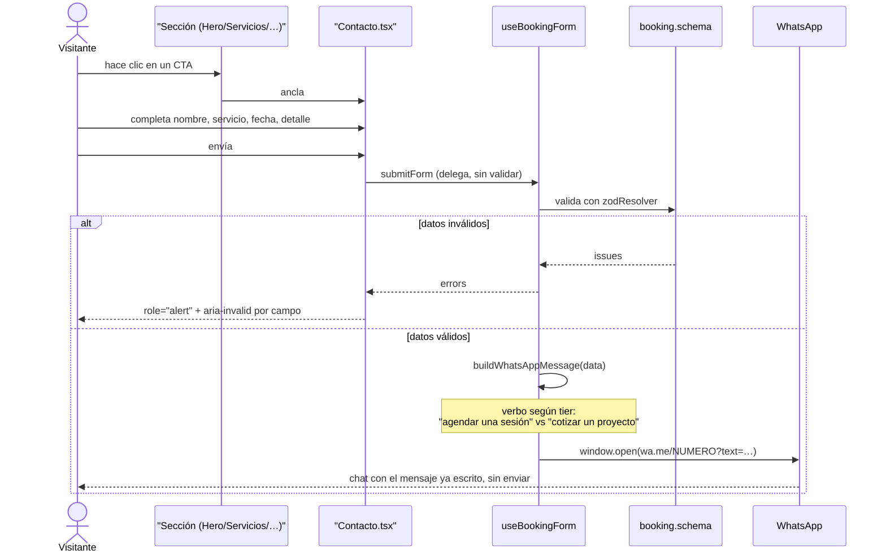

# Arquitectura — ALIENSKILEZ web

Fecha: 2026-08-12
Estado: implementado y verificado (`npm run lint`, `npm test` 24/24, `npm run build` limpios).
Alcance: one-pager de conversión para ALIENSKILEZ, productor musical en La Serena, Chile.

## 1. El problema que resuelve

Todo el sitio existe para **un solo resultado**: que un artista escriba por WhatsApp. No es un
portafolio, no es un EPK, no es una tarjeta de presentación. Cada sección se justifica por cuánto
acerca al visitante a ese mensaje, o se elimina.

Esa restricción es la que explica casi todas las decisiones de abajo: el cierre ocurre en
WhatsApp, así que el flujo de conversión no necesita backend; no hay CMS porque el contenido
cambia poco; no hay router porque una página que se recorre scrolleando convierte mejor que una
que obliga a navegar.

**Excepción acotada (ADR-11):** el catálogo de Spotify/YouTube del portfolio sí depende de una
función serverless en AWS Lambda — el resto del sitio, y en particular todo el flujo de
agendamiento, sigue sin backend propio. Ver ADR-11 para el porqué y el límite exacto de esa
excepción.

## 2. Stack

Deliberadamente más chico que un proyecto institucional. Es una decisión, no una limitación.

- **React 19** + **TypeScript estricto** (`strict: true` + `noUncheckedIndexedAccess`).
- **Vite 8 (flavor rolldown)** + `@vitejs/plugin-react` 6.
- **React Compiler** activo (ADR-3) — sin memoización manual en todo el repo.
- **Tailwind CSS v4** vía `@tailwindcss/vite`, CSS-first con `@theme`. Sin `tailwind.config.js`.
- **Framer Motion** para scroll-reveal y microinteracciones, con `reducedMotion="user"`.
- **Lenis** para el smooth scroll global (ADR-14).
- **3dsvg** (sobre Three.js + `@react-three/fiber` + `drei`) para el isotipo giratorio del Hero —
  **cargado en diferido**, nunca en el bundle inicial (ADR-12).
- **react-hook-form + zod** para el único formulario real.
- **Vitest** para la única lógica que puede fallar.
- **ESLint flat config** + `typescript-eslint` + `eslint-plugin-react-hooks@7` (que ya incluye
  las reglas del React Compiler, ADR-4) + Prettier.

Sin backend propio para el flujo de conversión, sin base de datos, sin autenticación, sin i18n,
sin router, sin librería de componentes. Cada una de esas ausencias es una decisión registrada
abajo. La única infraestructura fuera del sitio estático es la función serverless de ADR-11, de
solo lectura y sin datos de usuario.

## 3. Mapa de módulos

**Regla de dependencia:** las secciones dependen de primitivos de UI y de constantes, nunca entre
sí. `App.tsx` solo las ordena. `features/booking/` no importa ningún componente — es lógica pura
más un hook, y el único que lo consume es `Contacto.tsx`.

**Regla de orquestación:** la secuencia "validar → armar el mensaje → abrir WhatsApp" vive en
`useBookingForm`, nunca en el JSX. `Contacto.tsx` solo renderiza campos y delega el `onSubmit`.

## 4. Modelo de contenido

No hay entidades persistidas — no hay base de datos. Lo que sí existe es un modelo de **datos de
negocio tipados**, todos en `shared/constants/`, que las secciones consumen sin conocer su origen.

| Tipo                | Archivo                              | Forma                                         | Estado del dato                     |
| ------------------- | ------------------------------------ | --------------------------------------------- | ----------------------------------- |
| `Service`           | `constants/services.ts`              | `id`, `label`, `description`, `tier`          | **Real** — 10 servicios confirmados |
| `SITE` / `SOCIALS`  | `constants/site.ts`                  | nombre, ciudad, redes                         | Real, salvo URL de Spotify          |
| `WHATSAPP`          | `constants/whatsapp.ts`              | número internacional                          | **Placeholder bloqueante**          |
| `PortfolioItem`     | `constants/portfolio.ts`             | `title`, `artist`, `role`, `year`, `embedUrl` | Placeholder (5 slots)               |
| `ImpactMetric`      | `constants/alcance.ts`               | `value`, `label`, `caption`, `measurement`    | Placeholder `[XX]` (4 métricas)     |
| `Testimonial`       | `constants/testimonials.ts`          | `quote`, `author`, `role`                     | Placeholder (3 slots)               |
| `BookingFormValues` | `features/booking/booking.schema.ts` | inferido de zod (`z.infer`)                   | Real                                |

Cada tipo con dato pendiente lleva una bandera `pending: boolean`. Los componentes la usan para
degradar visualmente (atenuar el número, no renderizar un `<iframe>` vacío, ocultar un enlace sin
URL) en vez de mostrar algo roto. Ver ADR-6.

`ImpactMetric.measurement` es documentación en el código: describe **de dónde sale** cada cifra,
para que llenarla sea reproducible el año siguiente y no una estimación distinta cada vez.

## 5. El único flujo del sistema

El mensaje **no se envía solo**: se precarga y el visitante lo revisa antes de mandarlo. Es
deliberado — reduce la sensación de formulario que dispara algo fuera de su control, y le permite
agregar contexto.

## 6. Decisiones de arquitectura (ADR)

### ADR-1 — Sin backend: WhatsApp es el canal de cierre

**Contexto:** un formulario de contacto tradicional necesita un endpoint que reciba, valide,
persista y notifique.
**Decisión:** no hay servidor propio. El "envío" es construir una URL `wa.me` con el mensaje
codificado y abrirla en una pestaña nueva.
**Por qué:** el negocio ya cierra por WhatsApp Business — es donde el productor efectivamente
responde. Un backend agregaría hosting, base de datos, notificaciones y mantenimiento para
terminar reenviando el lead al mismo WhatsApp. El sitio queda 100% estático y desplegable en
cualquier CDN.
**Consecuencia aceptada:** no hay registro propio de leads; el historial vive en WhatsApp
Business. Si en algún momento hace falta analítica de conversión real, esto se reevalúa — no
antes.

### ADR-2 — Primitivos de UI propios, sin librería de componentes

**Contexto:** el patrón habitual en proyectos más grandes es envolver una librería (MUI, Chakra)
detrás de componentes `App*` para poder cambiarla sin reescribir la app.
**Decisión:** `Button`, `Badge`, `Section`, `Container` y `Kicker` se escriben directo sobre
Tailwind, en `shared/components/ui/`.
**Por qué:** ese patrón de wrapper existe para abstraer **una librería externa**. Acá no hay
ninguna que abstraer, así que el wrapper sería ceremonia sin propósito. Además, la identidad
visual (bordes duros, glow neón, brackets HUD) requeriría sobrescribir casi todos los estilos por
defecto de cualquier librería — más trabajo, no menos.
**Consecuencia:** los primitivos deben mantener una API consistente entre sí (`variant`/`size`),
porque no hay una librería que la imponga.

### ADR-3 — React Compiler vía `reactCompilerPreset`, no `babel-plugin-react-compiler` directo

**Contexto:** la forma documentada de activar el compilador en Vite clásico es
`babel: { plugins: [["babel-plugin-react-compiler", {}]] }` dentro de `@vitejs/plugin-react`.
**Decisión:** este proyecto usa el flavor **rolldown-vite**, donde se activa con
`@rolldown/plugin-babel` + `reactCompilerPreset()` de `@vitejs/plugin-react` — que es lo que el
scaffold ya traía.
**Por qué:** el objetivo real es que el compilador **compile**, no una sintaxis literal. Se
verificó contra el bundle de producción: 36 apariciones de `memo_cache_sentinel`, que es el
símbolo que emite el compilador al inicializar los slots de caché de cada componente. Forzar la
sintaxis de Vite clásico habría roto el build sin ganar nada.
**Consecuencia vinculante:** **no se usa `useMemo`, `useCallback` ni `React.memo` manual** en
ningún archivo. Ver ADR-9 para el efecto colateral que esto tuvo sobre el código.

### ADR-4 — `eslint-plugin-react-compiler` no se instala: está absorbido en `eslint-plugin-react-hooks@7`

**Contexto:** la especificación inicial pedía instalar `eslint-plugin-react-compiler` como gate de
lint separado.
**Decisión:** no se instala. Se verificó que `eslint-plugin-react-hooks@7.1.1` ya expone las
reglas del compilador, y que su config `recommended` activa entre otras `immutability`, `purity`,
`preserve-manual-memoization`, `set-state-in-effect`, `set-state-in-render` y `static-components`.
**Por qué:** el paquete standalone quedó deprecado al fusionarse en `react-hooks`. Instalarlo
duplicaría reglas ya activas y agregaría una dependencia sin mantenimiento.
**Verificación:** `node -e "require('eslint-plugin-react-hooks').configs.recommended"` lista las
16 reglas activas.

### ADR-5 — Dos CTA de negocio, un solo destino

**Contexto:** el diseño de referencia tenía un CTA único ("Cotiza tu sesión"). Pero ALIENSKILEZ
ofrece 10 líneas de servicio, y cuatro de ellas (asesoría, manager, marketing, construcción de
estudios) no son "sesiones" — decir "agenda tu sesión de marketing" suena mal y confunde el
alcance.
**Decisión:** dos CTA con copy distinto según el tipo de trabajo, ambos apuntando al **mismo**
formulario (`#contacto`):

- **"Agenda tu sesión"** — servicios con `tier: "sesion"` (producción, grabación, mezcla, máster,
  visuales, show en vivo). Es también el CTA persistente del navbar.
- **"Cotiza tu proyecto"** — servicios con `tier: "proyecto"` (asesoría, manager, marketing,
  construcción de estudios).

El `tier` vive en `constants/services.ts` y es la misma fuente que usa `buildWhatsAppMessage()`
para elegir el verbo del mensaje ("Quiero agendar una sesión de…" vs "Quiero cotizar un proyecto
de…"). Un solo dato gobierna copy del botón y texto del mensaje.
**Por qué un solo destino:** dos formularios duplicarían la validación y el mantenimiento para
capturar exactamente el mismo lead. El visitante elige el servicio exacto en el selector.
**Alternativa descartada:** preseleccionar el servicio al hacer clic en la card correspondiente.
Requeriría un canal de estado entre componentes y un efecto de sincronización que pelea con las
reglas de pureza del compilador (ADR-3), a cambio de ahorrarle al visitante un clic en un
`<select>` que ya tiene delante. No se justifica todavía.

### ADR-6 — Los datos de negocio que no existen se marcan, no se inventan

**Contexto:** al construir el sitio faltaban cifras de trayectoria, testimonios y trabajos del
portfolio. La tentación es rellenar con valores "realistas" para que el diseño se vea completo.
**Decisión:** cada dato faltante se publica con marcador visible (`[XX]`, `[Nombre del artista]`,
`[Reproductor pendiente]`) y una bandera `pending: true` que los componentes usan para degradar
la presentación. Nunca una cifra o cita plausible.
**Por qué:** una cifra inventada en un sitio de negocio es una afirmación falsa frente a clientes
reales, y "lanzamientos producidos" es verificable por cualquiera en Spotify. El costo de
desmentirla después es mucho mayor que el de mostrar un placeholder mientras tanto. El marcador
además **funciona como recordatorio**: es imposible desplegar sin notarlo.
**Consecuencia:** las secciones Alcance, Testimonios y Portfolio se renderizan siempre (para
poder evaluar el diseño), pero su contenido grita que está pendiente.

### ADR-7 — Los tokens de diseño viven en CSS (`@theme`), no en TypeScript

**Contexto:** una alternativa común es un `tokenRegistry.ts` que exporta los valores y se importa
donde haga falta.
**Decisión:** la paleta, tipografía, radios y espaciado de sección se definen una sola vez en
`src/styles/index.css` dentro de `@theme`, y Tailwind v4 genera las utilidades correspondientes
(`bg-surface-alt`, `text-text-muted`, `border-border-accent`, `py-section`, `font-display`).
**Por qué:** con Tailwind v4 CSS-first, `@theme` **es** el registro de tokens — mantener además
un espejo en TypeScript crearía dos fuentes de verdad que se desincronizan. Ningún componente
escribe un color literal; todos usan la utilidad generada.
**Verificación:** las 7 utilidades derivadas de tokens aparecen en el CSS compilado, y los 5
colores de la paleta aparecen con su valor exacto.
**Consecuencia:** un color nuevo se agrega en `@theme`, nunca como clase arbitraria
`bg-[#08cb00]` en un componente.
**Sin excepciones hoy.** Hubo una brevemente: mientras el isotipo del Hero corría sobre WebGL,
`shared/constants/theme.ts` repetía `--color-accent` como literal, porque Three.js no resuelve
`var()`. Al volver el isotipo al DOM (ADR-12, 3ª versión) esa constante y su test se eliminaron —
todo el color vuelve a salir del CSS.
**Si alguna vez hace falta un token en JavaScript** (canvas, WebGL, una librería que no lea CSS),
la regla es: literal en un módulo propio **más un test que lo ate al valor del CSS**, nunca un
literal suelto en un componente.

### ADR-8 — `no-restricted-imports` del core en vez de `eslint-plugin-import`

**Contexto:** la regla pedida era `import/no-relative-parent-imports: error`, para forzar el alias
`@/` en vez de rutas relativas largas.
**Decisión:** se implementa con la regla nativa `no-restricted-imports`, con el patrón `../*` y un
mensaje explícito.
**Por qué:** `eslint-plugin-import` declara ESLint `^9` como máximo en sus peer dependencies y
este proyecto usa ESLint 10; instalarlo exigiría `--legacy-peer-deps` y quedaría expuesto a romper
en cualquier actualización. La regla del core impone exactamente la misma restricción, con cero
dependencias nuevas.

### ADR-9 — Sin estado derivado de efectos: `useSyncExternalStore` y cómputo fuera del render

**Contexto:** el navbar cambia de fondo al scrollear. El patrón reflejo es
`useState` + `useEffect` con un listener que llama `setState`.
**Decisión:** `useScrolled()` usa `useSyncExternalStore(subscribe, getSnapshot)`. Y todo cómputo
impuro que antes iba en el cuerpo del componente (`new Date()` para el año del footer y para el
`min` del datepicker) se subió a constante de módulo.
**Por qué:** las reglas `react-hooks/set-state-in-effect` y `react-hooks/purity` (ADR-4) son
`error`, no advertencia — el código con el patrón reflejo **no pasa el lint**. Además
`useSyncExternalStore` lee el valor real en el primer render, sin el parpadeo que tiene la versión
con efecto.
**Regla general que se desprende:** si un componente necesita leer algo externo y cambiante
(scroll, `matchMedia`, tamaño de ventana), es `useSyncExternalStore`. Si necesita un valor impuro
pero estable durante la vida de la página, es una constante de módulo.

### ADR-10 — Texto negro sobre los botones de acento

**Contexto:** el color de acento de la marca es `#08CB00` (verde neón) y el color de texto es
`#EEEEEE`.
**Decisión:** los botones con fondo de acento usan texto `#000000`. El verde nunca se usa como
color de texto de cuerpo en tamaño chico — queda reservado a titulares, kickers, bordes e iconos.
**Por qué:** se calcularon los contrastes reales en vez de asumirlos. `#EEEEEE` sobre `#08CB00`
da **1.89:1** — reprueba cualquier nivel de WCAG. `#000000` sobre `#08CB00` da **9.55:1** (AAA).
La tabla completa está en [`design-system.md`](./design-system.md) §2.
**Nota:** la primera versión de este documento afirmaba 9.1:1 y 6.4:1 de memoria; al calcularlos
resultaron 9.55:1 y 5.74:1. El acento sobre `--color-surface` es **AA, no AAA** — por eso la
regla de no usarlo en texto chico es más estricta de lo que parecía.

### ADR-11 — Catálogo de Spotify/YouTube vía una función serverless en AWS Lambda

**Contexto:** RF-POR-002 pide que el portfolio refleje el catálogo real de ALIENSKILEZ en Spotify
(y, en menor medida, YouTube) sin depender de que alguien lo copie a mano en `portfolio.ts` cada
vez que sale un tema. Esto tensiona con ADR-1 ("sin backend, sin secretos"): la Web API de Spotify
que da metadata rica (álbumes, tracks, fechas) usa Client Credentials, y un `client_secret` no
puede vivir en el bundle de un sitio estático sin quedar visible en las devtools de cualquiera.
Se evaluaron tres caminos — embed oficial de Spotify (cero infraestructura, pero la UI la define
Spotify), función serverless (UI propia, pero introduce infraestructura), y seguir cargando a mano
(cero infraestructura, pero es exactamente el problema que este RF quiere resolver.
**Decisión:** función serverless, desplegada en **AWS Lambda** (no Vercel/Netlify Functions,
aunque técnicamente resolverían lo mismo) — el Productor ya opera en AWS y prefiere consolidar ahí
en vez de sumar un tercer proveedor a Vercel/Netlify (frontend) + WhatsApp (canal de contacto).
**Diseño de la función (especificado, no desplegado — ver el límite en `backlog.md` ALS-026):**

- **AWS Lambda con Function URL**, sin API Gateway — es un único endpoint `GET` de solo lectura,
  API Gateway sumaría cuotas y configuración que este caso no necesita.
- El `client_id`/`client_secret` de Spotify viven en **AWS Secrets Manager**, nunca en una
  variable de entorno del frontend ni en el repositorio.
- CORS restringido al origen de producción del sitio — nunca `*`.
- Caché en memoria del contenedor de Lambda con TTL (ej. 1 hora): a este volumen de tráfico no
  justifica DynamoDB ni ElastiCache, y respeta el rate limit de Spotify sin sumar infraestructura.
- El mismo patrón cubre YouTube Data API v3 (API key restringida, no OAuth) si ALS-027 avanza —
  incluso puede ser la misma función con un segundo handler, no un servicio aparte.
  **Consecuencia sobre ADR-1:** ADR-1 sigue vigente para **el flujo de conversión** — WhatsApp
  directo, sin servidor propio. Se abre una excepción acotada y explícita: una función de solo
  lectura, sin datos de usuario, sin estado, que no toca en nada el booking. No es un giro hacia
  "tener backend" en general.
  **Por qué no las otras dos:** el embed oficial (opción descartada) habría sido más simple y
  seguía siendo válido — queda registrado como alternativa si la función Lambda no llega a
  justificarse en el uso real. La carga manual (opción descartada) es lo que ya existía y es
  exactamente el problema que este RF busca resolver.
  **Límite honesto:** el handler de referencia está escrito (`aws/spotify-catalog/`), pero **no
  desplegado ni verificado contra AWS real** en este entorno — no hay credenciales de AWS
  disponibles acá. Ver `backlog.md` ALS-026 y ALS-031 para lo que falta.

### ADR-12 — Isotipo del Hero: extrusión 3D real con `3dsvg`, cargada en diferido

**Decisión:** el isotipo del Hero se extruye a geometría 3D con `3dsvg` (Three.js +
`@react-three/fiber` + `drei`), con `animate="spin"` para el giro continuo sobre el eje vertical y
`draggable` para que el visitante pueda tomarlo. Se carga con `lazy()`: el motor 3D pesa más que
todo el resto del sitio junto y no tiene por qué bloquear el primer render.

**Por qué hace falta 3D real:** un SVG es una superficie sin grosor. Con `rotateY` continuo queda
de canto dos veces por vuelta y desaparece. Y el bisel y el sombreado PBR que dan el aspecto de
objeto sólido no se consiguen con CSS: se probó apilando 28 copias del path con `translateZ` y
daba volumen, pero nunca el material.

**El costo, medido:**

| Chunk | Crudo | Gzip |
|---|---|---|
| Bundle inicial | 496.69 kB | **157.27 kB** |
| Chunk 3D (Three + fiber + drei) | 1,155.93 kB | **319.63 kB** |

El motor 3D pesa el doble que el resto del sitio. Va en un chunk diferido, así que el texto y los
CTA pintan sin esperarlo. Sigue siendo la deuda que ALS-024 tiene que resolver con datos de
Lighthouse (ALS-019), no antes.

**Reglas que impone esta decisión, todas aprendidas rompiéndolas:**

1. **El contenedor necesita tamaño explícito.** Los defaults de `<SVG3D>` son `width`/`height` al
   `"100%"`; sobre un padre de altura automática el canvas mide 0px y no se ve nada, sin ningún
   error.
2. **Se le pasan pocas props.** Los defaults están calibrados entre sí. Pasarle `background`,
   `width`/`height` y overrides de luz a la vez dejó el canvas vacío.
3. **La señal de "listo" es `onLoadingChange`, no `onReady`.** `onReady` dispara en el primer
   frame del canvas, antes de que termine la extrusión asíncrona.
4. **El color va como literal** (`HERO_MARK.COLOR`): Three.js pinta sobre canvas WebGL y no
   resuelve `var()`. Es la única excepción a ADR-7 y `theme.test.ts` la vigila.
5. **`SMOOTHNESS` es caro.** Medido sobre esta silueta: 0.6 genera ~300.000 vértices contra
   ~110.000 de 0.3, sin diferencia visible al tamaño del Hero.

**Degradación:** el mismo glyph se renderiza plano debajo del canvas y solo se apaga cuando la
extrusión confirma que terminó. Si WebGL no está disponible o la escena falla, queda el alien
plano con su glow — nunca un hueco (ADR-6). Un límite de error alrededor de la escena evita
además que una excepción de WebGL se lleve puesto el resto del Hero.

**Historial.** Esta ADR se reescribió tres veces antes de quedar acá, y las tres tuvieron causa
real. Vale la pena el registro porque la conclusión no es obvia:

| Versión | Decisión | Qué la invalidó |
|---|---|---|
| 1ª | CSS 3D, girar al arrastrar | El requisito pasó a giro **continuo**, y un plano girando desaparece de canto |
| 2ª | `3dsvg` | No renderizaba, y no se pudo diagnosticar |
| 3ª | Volumen por capas CSS | Daba volumen pero no bisel ni material PBR |
| 4ª (esta) | `3dsvg` | — |

La 2ª y la 3ª existieron por **un mismo bug de un carácter**, no por un problema de la
herramienta: un comentario de documentación dentro del archivo SVG contenía un doble guion, que
XML prohíbe dentro de comentarios. El `DOMParser` del navegador devolvía `parsererror`, `3dsvg`
no encontraba paths y abortaba **en silencio**. Al no poder diagnosticarlo, se descartó la
herramienta correcta y se construyó un reemplazo peor. Ver §7 de
[`engineering-guidelines.md`](./engineering-guidelines.md) para la lección que dejó.

### ADR-13 — Motion imperativo (paralaje, contadores) requiere su propio check de `prefers-reduced-motion`

**Contexto:** ALS-032 sumó animaciones ligadas a `useScroll`/`useTransform`/`animate()` de Framer
Motion (paralaje del Hero, traza de la timeline de Portfolio, contador de Alcance) — motion
imperativo, no las props declarativas `initial`/`animate`/`whileInView` que ya cubre
`<MotionConfig reducedMotion="user">` en `App.tsx`.
**Decisión:** cada uno de esos hooks/componentes llama `useReducedMotion()` de Framer Motion y
neutraliza su propia animación explícitamente (el paralaje y la nave del Hero quedan fijos en una
posición de reposo, la traza de Portfolio queda llena, el contador de Alcance salta directo al
valor final) — no se asume que `MotionConfig` los cubre.
**Por qué:** se verificó que `MotionConfig reducedMotion="user"` solo intercepta las animaciones
que pasan por las props declarativas de un componente `motion.*`; un valor de scroll leído con
`useScroll` y escrito a mano vía `style={{ y: ... }}` nunca pasa por esas props, así que
`MotionConfig` no tiene nada que interceptar ahí. Confirmarlo evitó un hueco de accesibilidad que
habría sido fácil de no notar (build y lint pasan igual con o sin el check).
**Regla general que se desprende:** todo motion nuevo que use `useTransform`/`useScroll`/
`animate()` fuera de las props declarativas de Framer necesita su propio `useReducedMotion()` —
no alcanza con que `MotionConfig` esté configurado en la raíz.

### ADR-14 — Smooth scroll con Lenis, no con `scroll-behavior: smooth`

**Contexto:** el sitio es un one-pager que se recorre scrolleando, con navegación por anclas y un
Hero con scroll-pin y paralaje. La primera versión usaba `scroll-behavior: smooth` del navegador.
**Decisión:** el suavizado lo controla **Lenis** (`useLenis`, inicializado una vez en `App.tsx`), y
`scroll-behavior` en el CSS pasa a `auto` explícitamente.
**Por qué:** `scroll-behavior: smooth` solo interpola los saltos programáticos (clic en un ancla);
el scroll con rueda o trackpad sigue siendo el del sistema, así que el sitio se siente suave al
navegar por el menú y abrupto al scrollear a mano. Lenis interpola **ambos**, que es lo que sostiene
la sensación de recorrido continuo que el Hero con paralaje ya insinúa.
**Por qué las dos cosas no conviven:** dejar `scroll-behavior: smooth` con Lenis activo pone dos
motores a interpolar el mismo scroll, y pelean. Por eso el CSS lo apaga a propósito — el comentario
en `index.css` lo dice, para que nadie lo "arregle" de vuelta.
**Accesibilidad:** `useLenis` no se inicializa si el usuario pide `prefers-reduced-motion`, y en ese
caso el scroll nativo queda intacto. Es el mismo criterio de ADR-13: el movimiento imperativo se
apaga explícitamente, no se asume cubierto.
**Costo:** ~15 kB gzip, dentro del bundle principal. A diferencia del motor 3D (ADR-12), esto sí
afecta a todo visitante desde el primer scroll, así que carga de forma estática.

## 7. Deuda conocida y diferida a propósito

Documentado como decisión, no como olvido:

- **Sin analítica de conversión.** No se sabe cuántos visitantes llegan al formulario ni cuántos
  abren WhatsApp. Se agrega cuando haya tráfico real que medir; hoy sería instrumentar a ciegas.
- **Sin preselección de servicio desde las cards** — ver ADR-5.
- **Sin pipeline de CI bloqueante.** `lint + test + build` se corren a mano antes de desplegar
  (ver [`quality-gates.md`](./quality-gates.md)). Para un sitio de una página que mantiene una
  sola persona, un CI pesado agrega fricción sin beneficio proporcional. Se reevalúa si el sitio
  crece o si toca el código más de una persona.
- **Sin imágenes propias.** No hay fotos del estudio ni isotipo definitivo; el favicon actual es
  interino. Bloqueado por falta de las piezas gráficas, no por código.

## 8. Documentos relacionados

- [`engineering-guidelines.md`](./engineering-guidelines.md) — cómo se escribe código acá.
- [`design-system.md`](./design-system.md) — tokens, contrastes verificados, tipografía.
- [`quality-gates.md`](./quality-gates.md) — umbrales y checklists previos a desplegar.
- [`rf-rnf-catalogo.md`](./rf-rnf-catalogo.md) — requisitos formales que este diseño satisface.
- [`backlog.md`](./backlog.md) — qué está hecho y qué falta.
