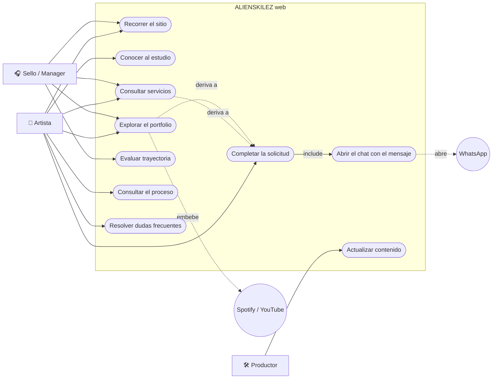

# Casos de Uso — ALIENSKILEZ web

Fecha: 2026-08-12

## Convenciones

- ID: `CU-MOD-001` · Prioridad: Alta, Media, Baja
- Estado: Propuesto, Validado, Implementado, **Verificado**

Mismo criterio de honestidad que [`rf-rnf-catalogo.md`](./rf-rnf-catalogo.md): **Verificado** es lo
que se comprobó de verdad; lo construido pero no comprobado queda **Implementado**, con el motivo.

## Diagrama

> Mermaid no tiene un tipo nativo de diagrama de casos de uso UML. Se aproxima con un `flowchart`:
> los actores como nodos rectangulares fuera del límite del sistema, los casos de uso como
> píldoras dentro.

## Trazabilidad

| Diagrama | ID formal | RF | Estado |
|---|---|---|---|
| UC1 | CU-NAV-001 | RF-NAV-001, RF-NAV-002 | Verificado |
| UC2 | CU-EST-001 | RF-EST-001 | Verificado |
| UC3 | CU-SRV-001 | RF-SRV-001…003 | Verificado |
| UC4 | CU-POR-001 | RF-POR-001 | Verificado |
| UC5 | CU-TRA-001 | RF-TRA-001, RF-TRA-002 | Verificado |
| UC6 | CU-PRO-001 | RF-PRO-001 | Verificado |
| UC7 | CU-FAQ-001 | RF-FAQ-001 | Verificado |
| UC8 | CU-BKG-001 | RF-BKG-001, 002, 005 | Verificado |
| UC9 | CU-BKG-002 | RF-BKG-003, RF-BKG-004 | Implementado |
| UC10 | CU-MNT-001 | RNF-MNT-001 | Verificado |

---

# CU-BKG-001 — Completar la solicitud de agendamiento

- Actor primario: Artista · Secundarios: ninguno
- **Objetivo:** entregar al productor los datos mínimos para que pueda cotizar sin repreguntar.
- Disparador: el visitante hace clic en cualquier CTA del sitio.
- Precondiciones: ninguna. No hay sesión ni registro.
- Postcondición éxito: los datos quedan validados y listos para transformarse en mensaje (CU-BKG-002).
- Postcondición fallo: el formulario señala qué corregir; no se pierde lo ya escrito.
- Prioridad: **Alta** · Frecuencia: alta
- HU: HU-BKG-001 · RF: RF-BKG-001, RF-BKG-002, RF-BKG-005 · Estado: Verificado

### Flujo principal
1. El visitante hace clic en un CTA y la página se desplaza al formulario.
2. El sistema muestra cuatro campos: nombre, tipo de servicio, fecha estimada, detalle.
3. El visitante completa nombre y elige un servicio de la lista de once opciones.
4. El visitante confirma.
5. El sistema valida todos los campos.
6. El sistema continúa con CU-BKG-002.

### Flujos alternos
- **A1: no sabe qué servicio necesita.**
  1. (Paso 3) Elige "Otro / no estoy seguro".
  2. (Pasos 4-6) sin cambios — sigue siendo un lead válido.
- **A2: aporta fecha y detalle.**
  1. (Paso 3) Completa además fecha estimada y descripción del proyecto.
  2. (Pasos 4-6) sin cambios; el mensaje resultante será más completo.
- **A3: llega desde una card de servicio.**
  1. (Paso 1) El CTA de la card usa el copy correspondiente al `tier` del servicio.
  2. (Paso 2) El destino es el mismo formulario; el visitante elige el servicio en el selector.

### Flujos de excepción
- **E1: nombre ausente o demasiado corto.** (Paso 5) El sistema marca el campo con
  `aria-invalid`, muestra "Ingresa tu nombre" con `role="alert"` y no continúa.
- **E2: servicio sin elegir.** (Paso 5) El valor vacío del selector no es válido → "Selecciona el
  tipo de servicio".
- **E3: fecha anterior a hoy.** (Paso 5) → "La fecha no puede ser anterior a hoy". El atributo
  `min` del campo ya lo desalienta, pero el schema revalida: el `min` de HTML es una ayuda, no una
  garantía.
- **E4: detalle excede el límite.** (Paso 5) → mensaje con el máximo permitido. El contador de
  caracteres bajo el campo lo anticipa antes de confirmar.

### Reglas de negocio
- RN-01: solo nombre y tipo de servicio son obligatorios. Cada campo obligatorio extra es una
  oportunidad de abandono.
- RN-02: el formulario arranca sin servicio preseleccionado, para forzar una elección consciente y
  no sesgar el lead hacia el primer ítem de la lista.
- RN-03: la validación nativa del navegador está desactivada (`noValidate`) — los mensajes los
  controla el sistema, para que sean consistentes y en español.

### Datos
- Entrada: nombre, tipo de servicio, fecha estimada (opcional), detalle (opcional).
- Salida: datos validados en memoria. **No se persisten en ningún lado.**

---

# CU-BKG-002 — Abrir el chat con el mensaje precargado

- Actor primario: Artista · Secundario: **WhatsApp**
- **Objetivo:** trasladar la conversación al canal donde el productor efectivamente responde, sin
  que el visitante tenga que redactar nada.
- Disparador: CU-BKG-001 termina con datos válidos (relación `include`).
- Precondiciones: datos validados.
- Postcondición éxito: se abre WhatsApp en una pestaña nueva con el mensaje escrito **y sin enviar**.
- Prioridad: **Alta** · Frecuencia: alta
- HU: HU-BKG-001 · RF: RF-BKG-003, RF-BKG-004
- Estado: **Implementado** — ver flujo de excepción E1.

### Flujo principal
1. El sistema resuelve la etiqueta legible del servicio a partir de su id.
2. El sistema elige el verbo según el `tier`: *"Quiero agendar una sesión de…"* para servicios de
   sesión, *"Quiero cotizar un proyecto de…"* para los de proyecto.
3. El sistema arma el mensaje con saludo, intención, y las líneas opcionales que correspondan.
4. El sistema codifica el mensaje en una URL `wa.me` con el número del negocio.
5. El sistema abre esa URL en una pestaña nueva.
6. El visitante revisa el mensaje, lo ajusta si quiere, y lo envía.

### Flujos alternos
- **A1: campos opcionales vacíos.** (Paso 3) Las líneas de fecha y detalle se omiten — no se
  generan líneas vacías.
- **A2: detalle con solo espacios.** (Paso 3) Se trata como ausente, igual que A1.
- **A3: id de servicio desconocido.** (Paso 1) Se usa el id crudo como etiqueta en vez de fallar —
  un mensaje imperfecto es mejor que un lead perdido (RN-03 de RF-BKG-003).

### Flujos de excepción
- **E1: el número de WhatsApp es el placeholder.** Ya no es la condición actual (ALS-001,
  cerrado el 2026-08-12): `WHATSAPP.NUMBER` es un número real. El aviso de desarrollo
  (`import.meta.env.DEV`) y el checklist de `quality-gates.md` §7 quedan como red de seguridad
  permanente — cualquier futuro cambio de número que deje la constante mal escrita se detecta
  igual, no solo la primera vez.
- **E2: el navegador bloquea la pestaña emergente.** El visitante queda sin feedback. No manejado
  hoy — ver deuda en `backlog.md` ALS-018.

### Reglas de negocio
- RN-01: **el mensaje nunca se envía solo.** Se precarga para que el visitante lo revise; reduce
  la sensación de estar disparando algo fuera de su control y le permite agregar contexto.
- RN-02: el número vive en una única constante. Ningún componente lo conoce.
- RN-03: no se registra el lead en ningún sistema propio — el historial vive en WhatsApp Business
  (ADR-1).

### Datos
- Entrada: `BookingFormValues` validado.
- Salida: URL `wa.me` abierta en pestaña nueva. Sin persistencia.

---

# CU-SRV-001 — Consultar servicios

- Actor primario: Artista / Manager
- **Objetivo:** entender qué se puede contratar y con qué alcance, antes de escribir.
- Precondiciones: ninguna · Prioridad: Alta · Frecuencia: alta
- HU: HU-SRV-001 · RF: RF-SRV-001…003 · Estado: Verificado

### Flujo principal
1. El visitante llega a la sección Servicios.
2. El sistema muestra las diez líneas, cada una con etiqueta y descripción de alcance.
3. Cada card ofrece el CTA correspondiente a cómo se contrata ese servicio.
4. El visitante hace clic y llega al formulario (CU-BKG-001).

### Flujos alternos
- **A1: busca un servicio que no está listado.** No hay flujo dedicado — la opción "Otro / no estoy
  seguro" del formulario lo absorbe.

### Reglas de negocio
- RN-01: **no se publican tarifas.** El costo depende del alcance real; una tarifa publicada
  obligaría a desmentirla o a forzar proyectos que no calzan.
- RN-02: el `tier` de cada servicio decide el copy del CTA y el verbo del mensaje. Un solo dato,
  dos consumidores.

---

# CU-POR-001 — Explorar el portfolio

- Actor primario: Artista / Manager · Secundario: Spotify / YouTube
- **Objetivo:** juzgar el resultado del trabajo por cuenta propia.
- Prioridad: Media · HU: HU-POR-001 · RF: RF-POR-001 · Estado: Verificado (con datos pendientes)

### Flujo principal
1. El visitante llega a Trabajos.
2. El sistema muestra las entradas como línea de tiempo, con rol, año, artista y descripción.
3. Si la entrada tiene pista publicada, se monta el reproductor embebido con carga diferida.
4. El visitante reproduce sin salir del sitio.

### Flujos alternos
- **A1: la entrada no tiene pista cargada.** (Paso 3) Se muestra un marcador de pendiente en lugar
  del reproductor. **Nunca un `<iframe>` con `src` vacío.**

### Reglas de negocio
- RN-01: el portfolio se presenta como progresión, no como grilla plana — cuenta una evolución.
- RN-02: no se publican créditos que no sean reales (ver CU-TRA-001 RN-01).

### Extensión decidida, no desplegada todavía (RF-POR-002)
ADR-11 (`architecture.md` §6) ya definió cómo: una función serverless en AWS Lambda. Cuando esté
desplegada (ALS-026), el paso 2 deja de leer solo de `PORTFOLIO_ITEMS` y pasa a reflejar el
catálogo real de Spotify, con un estado de carga intermedio mientras responde la función. En ese
momento corresponde una ficha `CU-POR-002` propia, con Spotify como actor secundario activo (no
pasivo) y sus propios flujos de excepción — la función no responde a tiempo, o el catálogo llega
vacío.

---

# CU-TRA-001 — Evaluar trayectoria

- Actor primario: Manager / Artista
- **Objetivo:** dimensionar la experiencia del productor con datos y opiniones de terceros.
- Prioridad: Media · HU: HU-TRA-001 · RF: RF-TRA-001, RF-TRA-002
- Estado: Verificado (con datos pendientes)

### Flujo principal
1. El visitante llega a Alcance y ve cuatro métricas destacadas.
2. Sigue a Testimonios y ve citas de artistas con nombre y proyecto.

### Flujos alternos
- **A1 (situación actual): no hay datos reales todavía.**
  1. Las métricas se muestran con marcador `[XX]` y atenuadas respecto al estilo de una cifra real.
  2. Los testimonios muestran texto explícito de pendiente.
  3. Ninguna cifra ni cita ficticia se publica.

### Reglas de negocio
- RN-01: **jamás se publica un dato de negocio inventado.** Una cifra falsa es una afirmación que
  después hay que desmentir frente a un cliente, y varias son verificables públicamente.
- RN-02: cada métrica documenta cómo se calcula, para que el dato sea reproducible y no una
  estimación distinta cada año.
- RN-03: un testimonio requiere cita textual y autorización de su autor.

---

# CU-NAV-001 — Recorrer el sitio

- Actor primario: cualquier visitante
- **Objetivo:** moverse entre secciones sin perder de vista cómo contactar.
- Prioridad: Alta · HU: HU-NAV-001 · RF: RF-NAV-001, RF-NAV-002 · Estado: Verificado

### Flujo principal
1. El visitante llega al hero.
2. Scrollea o usa los enlaces del navbar.
3. El navbar permanece fijo, con el CTA primario siempre visible.
4. Al pasar el umbral de scroll, el navbar toma fondo sólido para mantener legibilidad.

### Flujos alternos
- **A1: viewport móvil.** La navegación colapsa en un menú desplegable, operable con teclado, que
  se cierra al elegir una opción.
- **A2: navegación por teclado.** El primer elemento tabulable es un enlace de salto al contenido
  principal.

### Reglas de negocio
- RN-01: todo destino de navegación es un ancla de la misma página. No hay rutas.
- RN-02: los anclas compensan la altura del navbar (`scroll-padding-top`) para que ninguna sección
  quede tapada.

---

# CU-EST-001 · CU-PRO-001 · CU-FAQ-001 — Secciones informativas

Tres casos de uso de solo lectura que comparten estructura, agrupados para no repetir fichas casi
idénticas.

| | CU-EST-001 | CU-PRO-001 | CU-FAQ-001 |
|---|---|---|---|
| **Objetivo** | Saber quién está detrás | Saber qué pasa después de escribir | Resolver dudas antes de escribir |
| **Contenido** | Identidad y diferencial | 4 pasos del agendamiento | 6 preguntas frecuentes |
| **Prioridad** | Alta | Media | Media |
| **RF** | RF-EST-001 | RF-PRO-001 | RF-FAQ-001 |
| **Estado** | Verificado | Verificado | Verificado |

### Flujo común
1. El visitante llega a la sección.
2. El sistema muestra el contenido desde sus constantes.
3. El visitante sigue scrolleando hacia el formulario.

### Particularidades
- **CU-FAQ-001** usa `
/
` nativos: funcionan con teclado y sin JavaScript propio.
  Al agregar una pregunta hay que preservar ese comportamiento nativo.
- **CU-PRO-001** describe el proceso real de agendamiento; si el proceso del negocio cambia, esta
  sección tiene que cambiar con él o pasa a mentir.

### Regla de negocio común
- RN-01: el contenido sale de `constants/content.ts`. Agregar una pregunta o un paso es editar esa
  constante, nunca el componente.

---

# CU-MNT-001 — Actualizar contenido

- Actor primario: **Productor** (o quien mantenga el sitio)
- **Objetivo:** cambiar datos de negocio sin conocer React.
- Prioridad: Alta · Frecuencia: baja pero recurrente
- HU: HU-MNT-001 · RF: RNF-MNT-001 · Estado: Verificado

### Flujo principal
1. Abre el archivo de `src/shared/constants/` que corresponde al dato.
2. Edita el valor, respetando la forma del tipo.
3. Corre `npm run build` — TypeScript rechaza el cambio si rompe la forma esperada.
4. Despliega.

### Flujos alternos
- **A1: completar un dato pendiente.** Reemplaza el marcador por el valor real **y** cambia
  `pending: true` a `false`, para que el componente deje de degradar la presentación.

### Flujos de excepción
- **E1: se olvida cambiar `pending`.** El dato real se muestra con el estilo atenuado de pendiente.
  No rompe nada, pero se ve mal — está cubierto por el checklist de `quality-gates.md` §4.

### Reglas de negocio
- RN-01: ningún dato de negocio se edita dentro de un componente.
- RN-02: el número de WhatsApp vive en un solo archivo y su placeholder dispara un aviso visible en
  desarrollo.

## Documentos relacionados

- [`historias-usuario.md`](./historias-usuario.md) — historias que agrupan estos casos de uso.
- [`rf-rnf-catalogo.md`](./rf-rnf-catalogo.md) — requisitos formales vinculados.
- [`architecture.md`](./architecture.md) §5 — diagrama de secuencia del flujo de agendamiento.
